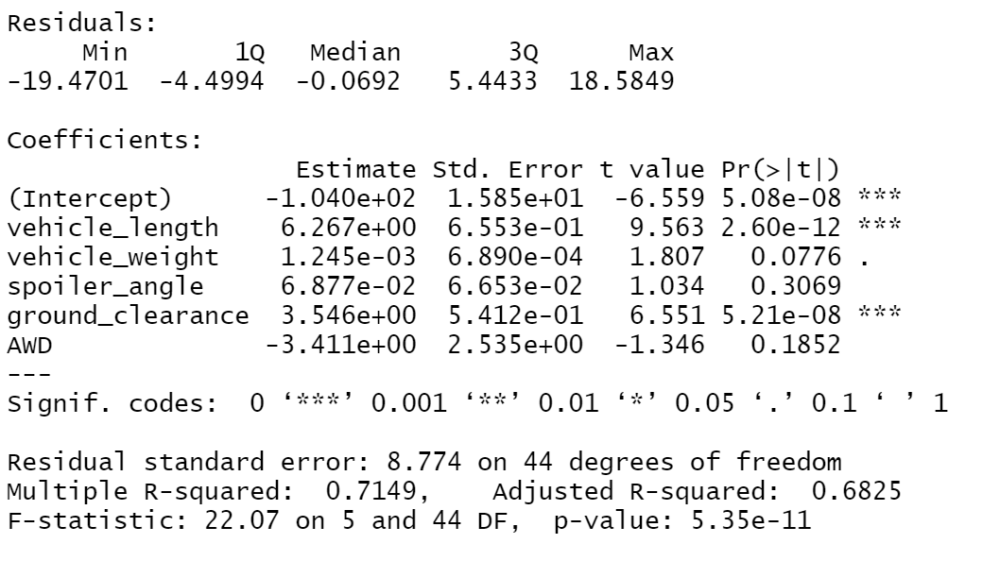
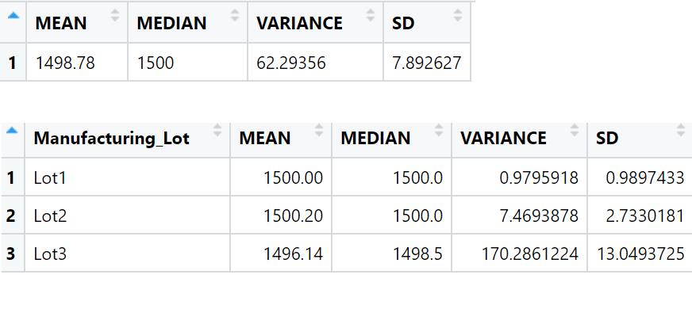
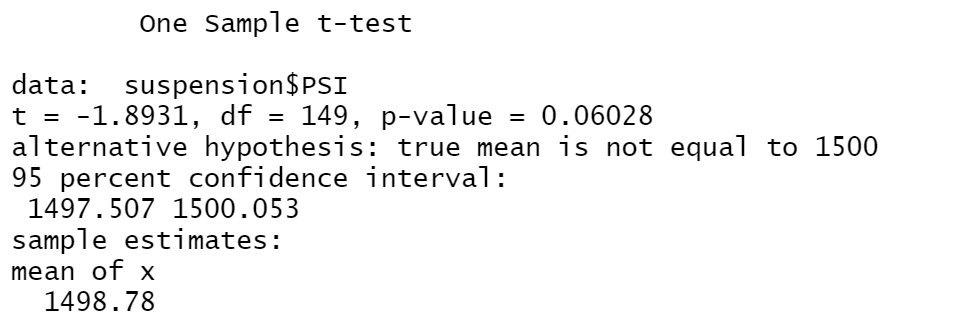
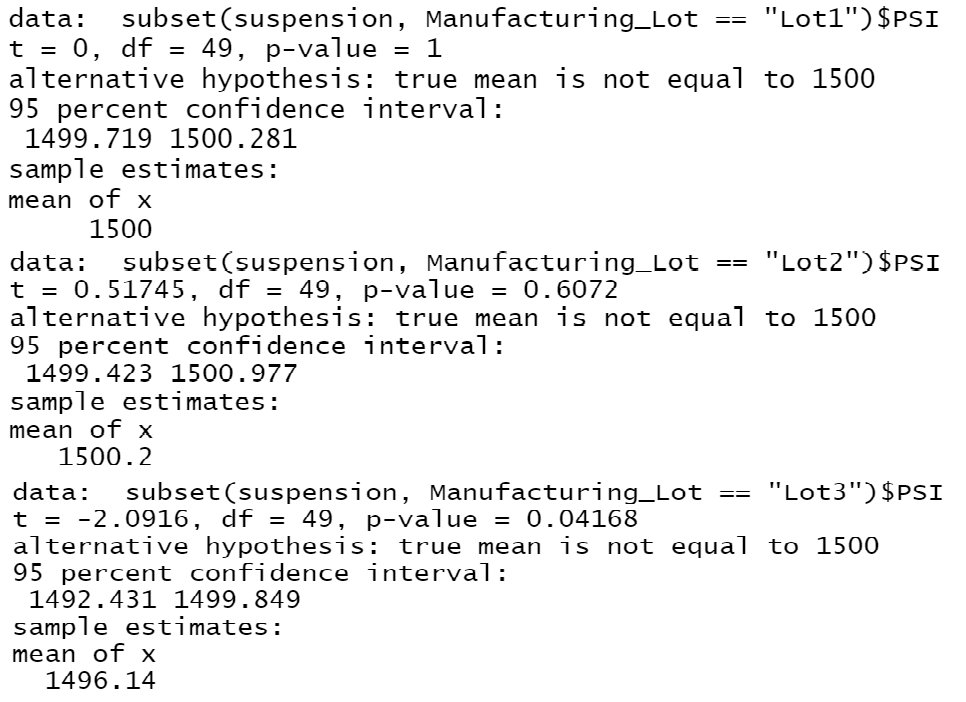

# MechaCar_Statistical_Analysis

## Overview
Helping AutosRUs to review their product development for the MechaCar.  Summaries below will discuss the results of each portion of the challenge (linear regression, summary stats, t-test, and additional study).

1.  ## Linear Regression to Predict MPG
    - Results:
    

    - Answers to Questions:

    a. Which variables/coefficients provided a non-random amount of variance to the mpg values in the dataset?

        -- Both spoiler_angle and vehicle_weight coefficients are approaching 0 (approx. 0.07 and 0.001 
        respectively).  These therefore show no statitstically significant affect on the mpg, as surprising 
        as that may be in truth (one might have assumed the weight of a vehicle and an aerodynaic spoiler 
        would have some noticable correlation, but this is why we look at the data!).
        -- AWD is an interesting variable to note as it's coefficient is approx -3, but the P score is well 
        over 0.05, signifying the randomness in its relation.  Looking at the data, there is a tiny downward 
        shift in the mpg of vehicles with AWD compared to those without, but statistically it is 
        insignificant nonetheless, and probably should not have been included due lacking continuous data.

    b. Is the slope of the linear model considered to be zero? Why or why not?

        -- While doing a mulitiple regression does not produce a singular way to visualize all of the 
        variables together in one slope, it does indicate whether the combination of given coefficients will  
        be a good predictor.  An overall P value of 0.00000000005 also points to a meaningful correlation 
        here beyond mere random scattering of points.  So we could say the slope is not zero.

    c. Does this linear model predict mpg of MechaCar prototypes effectively? Why or why not?

        -- Judging by the r-squared value of 0.7, this multiple regression model is a relatively good 
        predictor of outcomes in the dataset (70% likelihood that any given point would be predicted by it 
        within a reasonable margin of error).  However, it does suggest that there are other variables whose 
        effect should be factored in for a more precise and accurate prediction.
        
2.  ## Summary Statistics on Suspension Coils
    - Results:
    

    - Answers to Questions:

    The design specifications for the MechaCar suspension coils dictate that the variance of the suspension 
    coils must not exceed 100 pounds per square inch. Does the current manufacturing data meet this design 
    specification for all manufacturing lots in total and each lot individually? Why or why not?

        -- Lots 1 and 2 both have variance below 100 (about 1 and 7 respectively), whereas lot 3 shows a 
        variance of 170- well over the design specifictaion limit.  However, the overall summary of all three 
        lots together has a variance of only 62, which remains under the given limit.

3.  ## T-Tests on Suspension Coils
    - Results:
     

    - Interpretation:

    Similar to looking at the variance of the lots, the overall score shows a statistically meaningful sample 
    with reliable randomness (p values of 0.06 is still over 0.05).  However, when looking at each lot (p 
    values of 1, 0.6, and 0.04 respective to lots 1,2,and 3) we see that the third lot drops under 0.05 and 
    suggests something is affecting the sample that should be investigated, despite its mean being close.

4.  ## Study Design: MechaCar vs Competition

    ### Explanation(i.e. the given module assignment requirement)
    Designing a statistical study to compare performance of the MechaCar vehicles against performance of vehicles from other manufacturers.

    ### Answers to Questions

    a. What metric or metrics are you going to test?

        --Since gas prices are at the forefront of thought right now, we will focus on the mpg of our 
        MechaCar compared to the competitors.  Such an outcome can be hard to narrow down with regards to 
        many user/environment-related factors (accelaration habits, road conditions, urban/rural location, 
        traffic, maintenance, etc.).  The best way to overcome this would be to have very large datasets.

    b. What is the null hypothesis or alternative hypothesis?

        --Null says that, given the same type of vehicle in other respects (category of model, cylinders, 
        seating, doors, drivetrain, etc.) the MechaCar will have the *same* mean mpg as the competitor.  
        The Alternative is that, given the same type of vehicle in other respects, the MechaCar will have a 
        *higher* mean mpg than the competitor.

    c. What statistical test would you use to test the hypothesis? And why?

        --To compare means of the two vehicles, we can run a two-sample t-test. This will help us see if 
        there's a statistically signicant difference (p-value<0.05) between the two mean mpgs.  The most 
        difficult part will be getting a data set that is comparable on the given parameter of other 
        categorical information being the same, but group_by() and subset() functions can help!

    d. What data is needed to run the statistical test?

        --We would need a well distributed continuous data set that is randomly selected from each vehicle's 
        performance records.  The samples should be sufficiently large (including multiple iterations of the same vehicle off the assembly line from multiple areas, owners, industries, etc.), and should have normal distributions in their respective sets.  This will enable a meaninful t-test.
